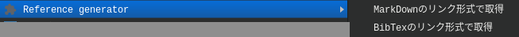

# Reference Generator

訪問したページのurlとtitleタグを元にMarkdownやBibTexの引用を作成する拡張機能です。

## Chromeへの追加

[Chrome拡張機能](chrome://extensions)からデベロッパーモードを起動して"パッケージ化されていない拡張機能を読み込む"を選び、src以下を追加してください。

## 使いかた

右クリックメニューから`Reference Generator`> `MarkDown`or`BibTex`でクリップボードにコピーされます。

